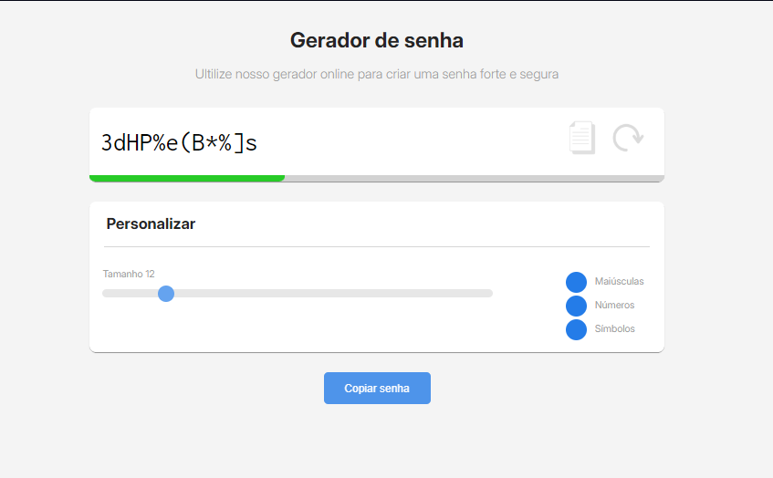

# 🎒 Gerador de Senhas Seguras 🔐

Este projeto é um gerador de senhas seguras desenvolvido com **JavaScript**, **HTML** e **CSS puro**. Ele permite criar senhas personalizadas com base em critérios configuráveis, como uso de letras maiúsculas, números e símbolos. Além disso, o projeto inclui uma barra de segurança que indica o nível de robustez da senha gerada.

## 🚀 Funcionalidades

- **Geração de senhas personalizadas**:
  - Tamanho ajustável através de um controle deslizante.
  - Inclusão de letras maiúsculas, números e símbolos.
- **Indicador de segurança**:
  - Barra visual que mostra o nível de segurança da senha gerada.
- **Copiar senha**:
  - Botão para copiar a senha gerada diretamente para a área de transferência.
- **Interface simples e intuitiva**:
  - Design limpo e fácil de usar.

## 🛠️ Como Usar

1. **Ajuste o tamanho da senha**:
   - Use o controle deslizante para definir o comprimento da senha desejada.

2. **Selecione os critérios**:
   - Marque as caixas de seleção para incluir letras maiúsculas, números e símbolos.

3. **Gere a senha**:
   - Clique no botão "Gerar Senha" para criar uma nova senha com base nas configurações selecionadas.

4. **Copie a senha**:
   - Clique no botão de cópia para salvar a senha gerada na área de transferência.

## 🖥️ Tecnologias Utilizadas

- **HTML**: Estrutura da interface do usuário.
- **CSS**: Estilização e design responsivo.
- **JavaScript**: Lógica de geração de senhas e interatividade.

## 🎨 Exemplo de Interface

